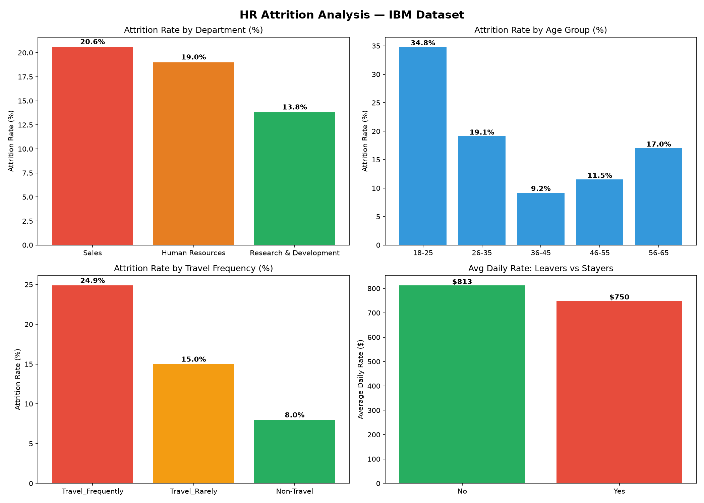
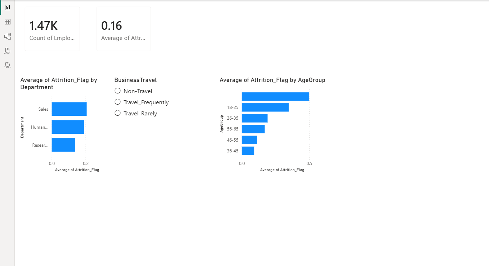

# 👥 HR Attrition Analysis (ETL + SQL + Visualization)

## Executive Summary
Analyzed IBM HR dataset of 1,470 employees to identify key drivers of employee attrition. Built a full ETL pipeline and multi-panel visualization revealing that Sales has the highest attrition (20.6%) and frequent business travelers are 3x more likely to leave than non-travelers.

## Business Problem
HR teams need to understand why employees leave to reduce hiring costs and retain talent. This project answers: Which departments, age groups, and work patterns drive the highest attrition?

## Tools & Technologies
`Python` `Pandas` `SQLite` `SQL` `Matplotlib` `Seaborn` `Power BI` `Jupyter Notebook`

## Key Findings
- Overall attrition rate: **16.1%** (237 out of 1,470 employees)
- **Sales department** has the highest attrition at 20.6%
- **18-25 age group** has 34.8% attrition — youngest employees leave most
- **Frequent travelers** have 24.9% attrition vs 8.0% for non-travelers
- Employees who left earned **$63 less per day** on average than those who stayed

## Visualization

## Interactive Power BI Dashboard

Built an interactive Power BI dashboard with KPI cards, department/age group breakdowns, and a slicer for filtering by travel frequency. The `.pbix` file is included in the `dashboard/` folder for hands-on exploration.

## Methodology
1. **Extract** — Loaded IBM HR dataset (1,470 employees, 10 features)
2. **Transform** — Engineered AgeGroup and DistanceCategory features, created Attrition_Flag
3. **Load** — Saved to CSV and SQLite database
4. **Analyze** — 5 SQL queries using aggregations and GROUP BY
5. **Visualize** — 4-panel chart showing attrition across departments, age, travel, and compensation

## How to Run
1. Clone repo: `git clone https://github.com/akshayjegy/hr-analytics-dashboard.git`
2. Install dependencies: `pip install -r requirements.txt`
3. Run: `jupyter notebook notebooks/hr_etl_pipeline.ipynb`

## Data Source
IBM HR Analytics Employee Attrition Dataset (Kaggle)

## Next Steps
- Add logistic regression model to predict attrition probability
- Expand dataset with salary and performance review data
- Add drill-through pages for department-level deep dives